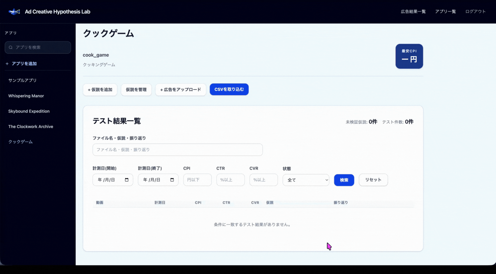

# Ad Creative Hypothesis Lab

広告クリエイティブの**仮説作成・テスト結果の記録・振り返り**を、アプリごとに一元管理するWebアプリケーションです。

公開URL: [https://ad-creative-hypothesis-lab.onrender.com](https://ad-creative-hypothesis-lab.onrender.com)

## 概要

前職でゲームアプリの広告クリエイティブを作成する仕事をしておりました。
広告クリエイティブの改善では、「どんな仮説をもとに作った広告なのか」「テスト結果はどうだったのか」「次に何を試すのか」を考えていくのですが、それぞれを別のツールに依存していたため、学習したことを活かして、仮説、広告、結果、フリか芹を一元化して管理するアプリを作成しました。

本アプリでは、仮説から広告動画、テスト結果、振り返りまでをつなげて記録します。
テストの経緯をあとから追える状態にし、次のクリエイティブ作成へ活かすことを目的としています。

## 利用の流れ

### 1. アプリを登録する

アプリ名、広告配信で使用するキャンペーン名、説明、アイコンを登録します。
登録したアプリごとに、広告仮説・動画・テスト結果を管理します。


### 2.仮説を登録し、仮設動画を紐づけ、csvから結果を取り込み、振り返りを記録する

広告で検証したい内容を仮説として登録します。
仮説を選択してMP4動画をアップロードすると、テスト結果待ちの記録が自動で作成されます。
広告媒体から出力したCSVを取り込み、CPI・CTR・CVRなどのテスト結果を記録します。
結果を確認したうえで振り返りを記入します。



### 3 結果を確認し、次の仮説・広告制作に活かす

過去の結果や他のアプリの広告結果を元に次の仮説を作成します。

## 動作確認用ユーザー

動作確認用に以下のユーザーを作成済みです。
機能確認の際はこちらをご利用ください。

```text
  メールアドレス: demo_user@example.com
  パスワード: password
```

## 主な機能

### アプリ・仮説・広告の管理

- アプリの登録・検索・編集・削除
- アプリごとの仮説作成・編集・削除
- 仮説にひもづく広告動画（MP4）のアップロード
- キャンペーン名と連番を用いた動画ファイル名の形式チェック
- 広告アップロード時に、テスト結果待ちのレコードを自動作成

### テスト結果・振り返り

- CSVファイルからテスト結果を一括取り込み
- Meta / Google / AppLovin の媒体を記録
- CPI・CPM・CTR・CVR・インプレッション・予算・消化額を管理
- 取り込み後の数値を編集
- テスト結果に対して1件の振り返りを登録・編集
- テスト結果の状態を管理

```text
テスト結果待ち → 結果取り込み済み → 振り返り済み
```

### 横断的なテスト結果の参照

- 全ユーザーのテスト結果を横断して一覧表示
- アプリ名・広告ファイル名・仮説・振り返り内容による検索
- 状態による絞り込み、数値・日付による並び替え
- 他ユーザーの結果は閲覧専用とし、編集・削除の操作は表示しない

### 認証・権限

- Deviseによる会員登録・ログイン・ログアウト
- 未ログインユーザーはアプリ管理画面へアクセス不可
- アプリの編集・削除、仮説の編集・削除、テスト結果の個別編集・削除、振り返りの編集は作成者だけが行えるように制御

## 技術スタック

| 分類                 | 技術                                        | バージョン              |
| -------------------- | ------------------------------------------- | ----------------------- |
| バックエンド         | Ruby on Rails                               | 8.1.3.1                 |
| 言語                 | Ruby                                        | 3.4.10                  |
| データベース         | PostgreSQL                                  | 17                      |
| フロントエンド       | Hotwire Turbo / Stimulus                    | 2.0.23 / 1.3.4          |
| CSS                  | Tailwind CSS                                | 4.6.0                   |
| 認証                 | Devise                                      | 5.0.4                   |
| 検索・ソート         | Ransack                                     | 4.4.1                   |
| ファイルアップロード | Active Storage / active_storage_validations | Rails標準 / 4.1.1       |
| テスト               | RSpec Rails / Capybara / Selenium           | 8.0.4 / 3.40.0 / 4.48.0 |
| 開発環境             | Docker Compose                              | -                       |
| デプロイ             | Render                                      | -                       |

## ER図


## ローカルでの起動方法

### 1. Docker Secretsを用意

`docker_secrets`ディレクトリを作成し、ローカル用のPostgreSQLユーザー名とパスワードをそれぞれ保存します。

```text
docker_secrets/
├── db_user.txt
└── db_password.txt
```

### 2. コンテナを起動

```bash
docker compose up --build
```

### 3. データベースを準備

```bash
docker compose exec web bin/rails db:prepare
```

サンプルデータを登録する場合は、初回のみ次を実行します。

```bash
docker compose exec web bin/rails db:seed
```

ブラウザで [http://localhost:3000](http://localhost:3000) を開きます。

## 動作確認用アカウント

`db:seed`を実行した**ローカル環境**では、次のアカウントでログインできます。

```text
メールアドレス: user1@example.com
パスワード: password
```

公開環境では、トップページから会員登録して利用できます。

## テスト

```bash
docker compose exec -T web bundle exec rspec
```

## 今後の改善案

- レスポンシブ対応
- チーム利用を想定したメンバー・権限管理
- 広告媒体ごとに異なるCSVフォーマットへの対応
